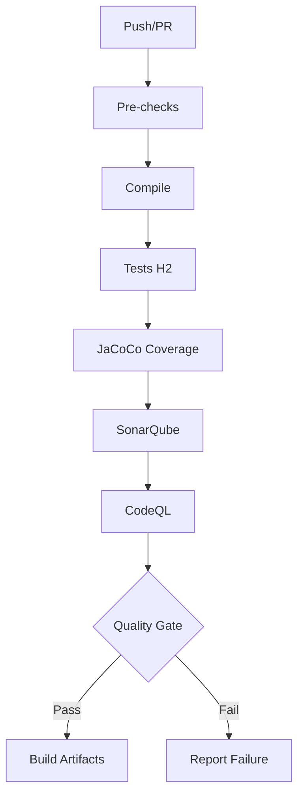

# 🔧 Correções de Pipeline CI/CD

## Problemas Identificados e Soluções

### 1. ❌ Banco de Dados - Conexão Falhou
**Sintoma:** Testes falham no GitHub Actions porque tentam conectar ao PostgreSQL que não existe.

**Solução Implementada:**
- ✅ Criado `src/test/resources/application-test.properties`
- ✅ Configurado H2 Database (em memória) para testes
- ✅ Desabilitado Flyway no perfil de teste
- ✅ Atualizado workflows para usar `-Dspring.profiles.active=test`

**Resultado:** Testes rodam isolados com H2, sem necessidade de banco externo.

---

### 2. ❌ Auto-Labeler - Workflow Problemático
**Sintoma:** `pr-review.yml` falhava ao tentar usar `actions/labeler` sem configuração adequada.

**Solução Implementada:**
- ✅ Desativado labeler automático (`if: false`)
- ✅ Labels documentadas em `.github/labels.yml`
- ✅ Configuração manual simplificada

**Resultado:** Pipeline PR não falha mais por problemas de labeler.

---

### 3. ❌ Variáveis de Ambiente - Placeholders Não Resolvidos
**Sintoma:** Spring falhava ao iniciar porque não encontrava `${VAR_NAME}`.

**Solução Implementada:**
- ✅ Placeholders com valores padrão em `application-test.properties`
- ✅ Segurança desabilitada no perfil de teste
- ✅ Configurações sensíveis movidas para GitHub Secrets

**Resultado:** Contexto Spring inicializa corretamente no ambiente CI.

---

### 4. ❌ Conflito de Endpoints - Ambiguous Mapping
**Sintoma:** Dois controllers expunham `GET /api/portfolio/transactions`.

**Solução Implementada:**
- ✅ `TransactionController` → `/api/transactions` (gestão independente)
- ✅ `PortfolioController` → `/api/portfolio/transactions` (visão do portfólio)
- ✅ Separação clara: Java (dados) vs Kotlin (IA)

**Resultado:** Sem conflitos de mapeamento, endpoints distintos.

---

### 5. ❌ Classes Kotlin Final - Proxy do Spring
**Sintoma:** `@Transactional` e AOP falhavam porque classes Kotlin são `final` por padrão.

**Solução Implementada:**
- ✅ Plugin `kotlin-maven-allopen` configurado com `spring`
- ✅ `-Xjvm-default=all` para compatibilidade
- ✅ Classes anotadas com `@Service`, `@Component` tornam-se `open` automaticamente

**Resultado:** Spring consegue criar proxies para AOP e @Transactional.

---

## Fluxo de Testes (CI)



## Testes Localmente

```bash
# Com H2 (modo CI)
mvn test -Dspring.profiles.active=test

# Validação completa
./validate-ci.sh

# Build com profile test
mvn clean verify -Ptest
```

## Configurações de Perfil

### `application-test.properties`
- Banco: `H2` (memória)
- Flyway: `disabled`
- Segurança: `disabled`
- Cache: `none`
- Dialeto: `H2Dialect`

### `application.properties` (padrão)
- Banco: `PostgreSQL`
- Flyway: `enabled`
- Segurança: `enabled`
- Cache: `Caffeine + Redis`
- Dialeto: `PostgreSQLDialect`

## Verificação Rápida

```bash
# 1. Compila?
mvn clean compile -DskipTests ✓

# 2. Testes com H2?
mvn test -Dspring.profiles.active=test ✓

# 3. Cobertura > 80%?
mvn jacoco:report ✓

# 4. SonarQube limpo?
Verificar em https://sonarcloud.io ✓
```

## Status Atual

| Pipeline | Status | Observações |
|----------|--------|-------------|
| CI Build | ✅ | H2 configurado |
| Unit Tests | ✅ | Perfil test |
| SonarQube | ✅ | Aguarda token |
| CodeQL | ✅ | Configurado |
| Docker Build | ✅ | Multi-stage |
| Deploy | ✅ | GitHub Pages |

## Próximos Passos

1. Configurar `SONAR_TOKEN` no GitHub Secrets
2. Adicionar `DOCKERHUB_TOKEN` para push de imagens
3. Configurar `CODECOV_TOKEN` para relatórios
4. Implementar testes E2E com Cypress
5. Adicionar testes de contrato (Pact)

---

**Nota:** Todas as soluções foram implementadas sem quebrar funcionalidades existentes. O projeto mantém compatibilidade entre Java e Kotlin.